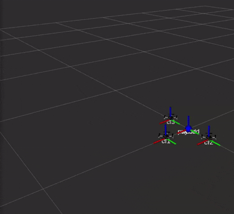
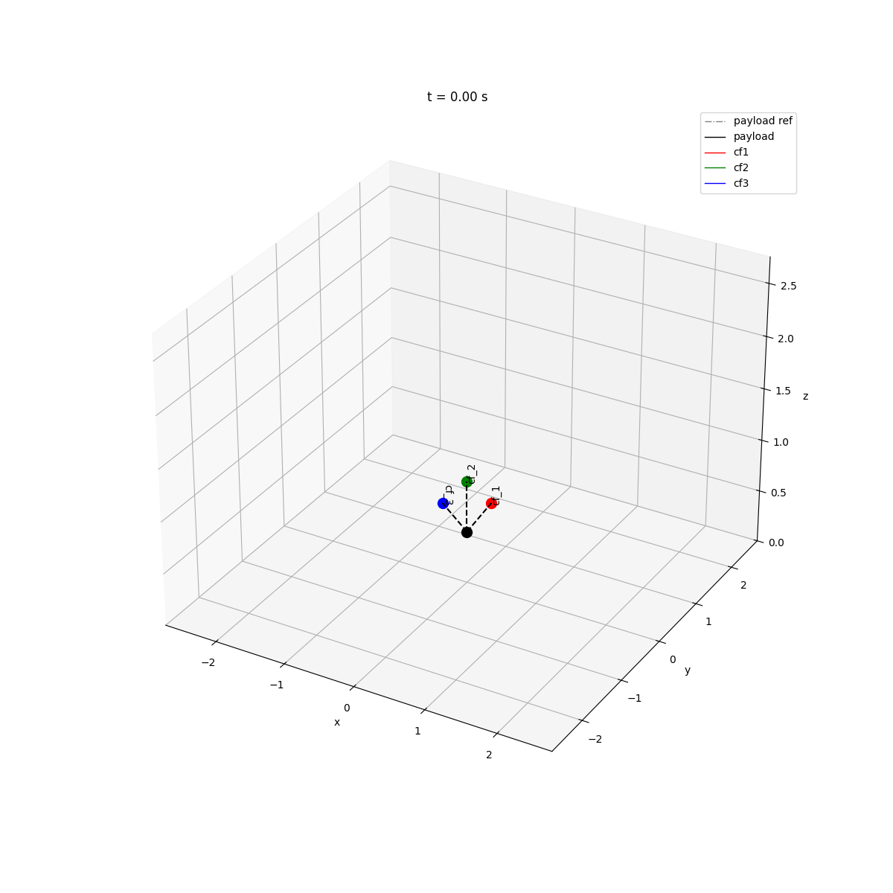
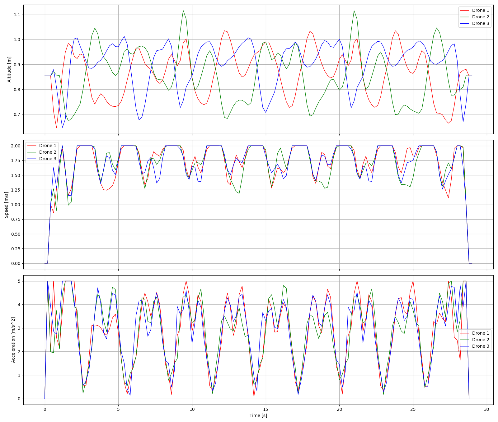
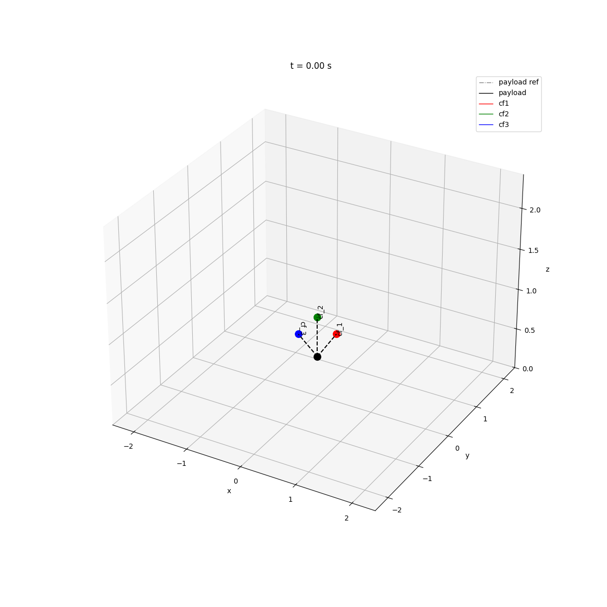
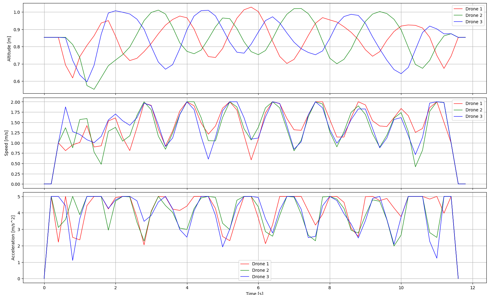

# crazyflo

[Watch the demo video](https://github.com/user-attachments/assets/48989a06-b6cf-4c2b-961a-385476a8ae29)

Cooperative payload transport with a swarm of three [Crazyflie](https://www.bitcraze.io/products/crazyflie-2-1/) drones connected to a shared payload via cables.

## What it does

Three drones fly in formation, each attached to the same payload by a cable. An **Optimal Control Problem (OCP)** is solved offline to generate dynamically feasible, collision-free trajectories for all drones simultaneously. The resulting trajectories are uploaded to the firmware and executed.




### Figure-8

| Animation | States (altitude / speed / acceleration) |
|:---:|:---:|
|  |  |

### Ellipse

| Animation | States (altitude / speed / acceleration) |
|:---:|:---:|
|  |  |

## Repository layout

```
crazyflo/
└── crazyflo_planner/   # ROS 2 Python package (planning + execution)
```

See [crazyflo_planner/README.md](crazyflo_planner/README.md) for the full module reference, configuration details, and step-by-step usage.

## Quick start

```bash
# 1 — Plan trajectories (offline, no drones needed)
cd crazyflo_planner/crazyflo_planner
python crazyflo_solve.py

# 2 — Launch simulation
ros2 launch crazyflo_planner sim.launch.xml

# 3 — Or launch on real drones + run the mission script
ros2 launch crazyflo_planner real.launch.xml
ros2 run crazyflo_planner mission
```

---

## Key dependencies

| Tool | Role |
|---|---|
| ROS 2 Jazzy | Middleware |
| [Crazyswarm2](https://imrclab.github.io/crazyswarm2/) | Drone communication & simulation |
| [CasADi](https://web.casadi.org/) | OCP solver |
| NumPy / SciPy / Matplotlib | Numerics & visualisation |

## License

MIT — see [crazyflo_planner/LICENSE](crazyflo_planner/LICENSE).
